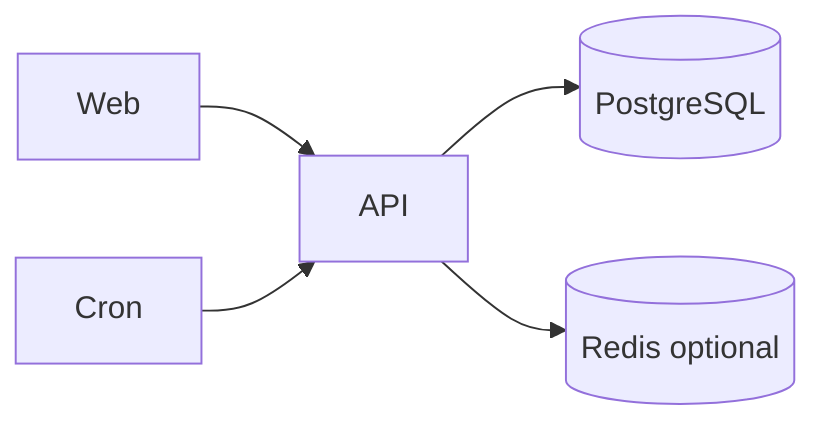

# Stackfolio Architecture Blueprint

## Deployable units

| Unit | Stack | Port |
|------|-------|------|
| app-web | Next.js 15 App Router | 3000 |
| app-api | NestJS 10 | 3001 |
| postgres | PostgreSQL 16 | 5432 |
| redis | Redis 7 (optional profile) | 6379 |

## Feature modules

See [feature-based-structure.md](./feature-based-structure.md).

## Data flow

1. Web uses TanStack Query → REST API
2. Auth.js issues JWT → API `JwtAuthGuard`
3. Editor iframe → `GET /cv-preview/:id`
4. Export → `POST /resume-projects/:id/export-pdf` (Playwright)
5. Cron `@nestjs/schedule` → ingestion services → PostgreSQL

## Diagram

